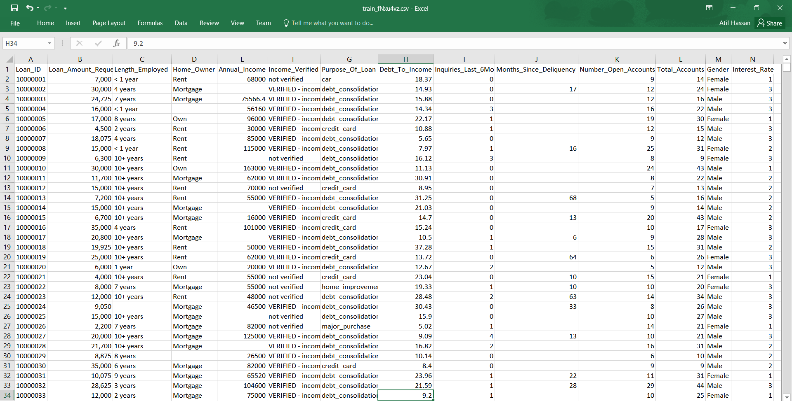

# JanataHack-Machine-Learning-for-Banking
Data at a Glance

# A Description of my Methodology
#### Feature Engineering & Approach
1.Loan_Amount_Requested was converted to numeric by removing commas
2.Catboost requires minimum pre-processing while lightgbm requires some more pre-processing
3.All NaN's were converted to "NaN"
4.Created 2 new features.
5.For lightgbm all string features were label encoded
6.Catboost was somewhat tuned and the first set of prediction probabilities were generated
7.LightGBM was somewhat tuned and the second set of prediction probabilities were generated
8.Finally, a weighted average of the probabilities from both classifiers are used to generate the final predictions
#### Tools used
1.Python for programming
2.sklearn and numpy libraries for methodology
3.lightgbm and catboost library for the final model
4.matplotlib and seaborn was used for plotting and analyzing the data
#### Competition Result
Rank: 2nd on public LB and 4th on private LB

[link to LeaderBoard!](https://datahack.analyticsvidhya.com/contest/janatahack-machine-learning-for-banking/#LeaderBoard)
